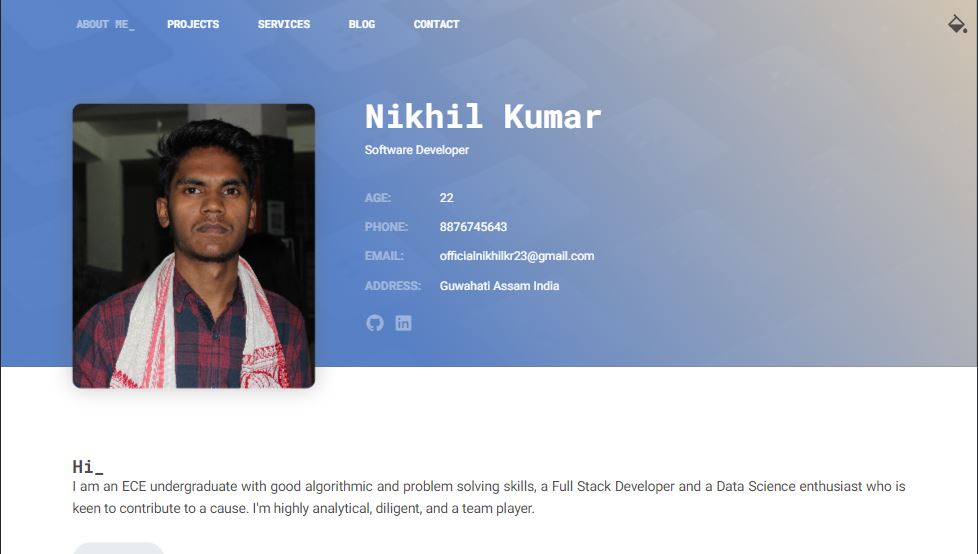

  

<h1 align="center">
  Portfolio -v1
</h1>

  Hi_ 
  Welcome to my portfolio repo. I have kept this code open source because it's a very basic project in itself.  

## ✔ Fork this repo!
Customize the code and get started with your own website.

### ❗❕❗ Also services such **emailjs** for sending Email via contact forms have been used, which can be learned via Youtube❗
> Or you can contact me!
> 
Happy Learning ✔

## Tech Stack

#
### This [website](https://nikhilkr23.github.io/portfolio_v1/index.html) is hosted using 

* [GithubPages](https://pages.github.com/)

#

Do let me know if you've any suggestions/queries.
